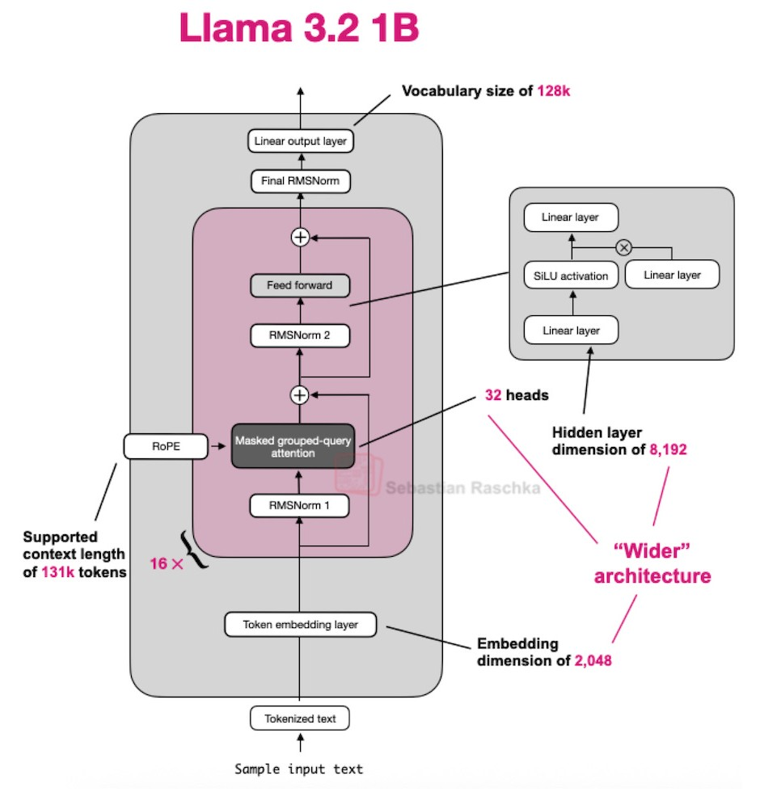

# smolLLM

A fast lightweight inferrence server made using CUDA.

Inspired by [tiny-vLLM](https://github.com/jmaczan/tiny-vllm) by [jmaczan](https://github.com/jmaczan).

---

## Implementation Status

| Component | Status |
|-----------|:------:|
| Model Loading | ✅ |
| Weight Mapping | ✅ |
| Token Embedding | ✅ |
| RMSNorm | ✅ |
| Rotary Positional Embeddings (RoPE) | 🚧 |
| Grouped Query Attention | 🚧 |
| Feed Forward Network | ⏳ |
| Output Projection | ⏳ |
| Token Generation | ⏳ |

---

## Supported Models
- Llama 3.2 1B Instruct

Note: Support for additional models are planned in version 2.0.

---

## form Support

| Platform | Status |
|----------|:------:|
| Linux | ✅ |
| NVIDIA GPUs (CUDA) | ✅ |
| AMD GPUs (HIP) | Planned(v1.3) |
| Vulkan Compute | Planned(v1.4) |
| Android | Planned(v3.0) |
| Windows | Not officially suppported but can be build|  

---

## Project Goals

- Build an LLM inference engine entirely in modern C++ and CUDA
- Understand every stage of transformer inference from weight loading to token generation
- Maintain a modular architecture that supports multiple GPU backends
- Explore efficient GPU programming and memory management techniques
- Keep the implementation easy to understand without compromising performance

---

## Architecture

<p align="center">
  
</p>

> **Source:** Adapted from Sebastian Raschka's *LLM Architecture Gallery*  
> https://sebastianraschka.com/llm-architecture-gallery/

---

## Tech Stack

| Category | Technology |
|----------|------------|
| Language | C++20 |
| GPU Computing | CUDA |
| Build System | CMake |
| Build Generator | Ninja |
| Build Scripts | `build.sh`, `run.sh` |

### Dependencies

- CUDA Toolkit
- CMake
- Ninja

---

## Building

```bash
git clone https://github.com/<your-username>/smolLLM.git

cd smolLLM

./build.sh
```

---

## Running

```bash
./run.sh
```

---

## Project Structure

```text
smolLLM/
├── assets
├── build
├── build.sh
├── include
├── models
├── src
├── CMakeLists.txt
├── readme.md
├── run.sh
└── test.sh
```

---

## Roadmap

### v1.0 — Basic Inference Engine

- [ ] Complete transformer implementation
- [ ] Generate output tokens from input token IDs
- [ ] Llama 3.2 1B Instruct support 

### v1.1 — Backend Refactor

- [ ] Separate GPU backend from inference engine
- [ ] Introduce backend abstraction layer
- [ ] Improve code modularity

### v1.2 — Tokenizer

- [ ] Built-in tokenizer
- [ ] Tokenization utilities

### v1.3 — AMD GPU Support

- [ ] HIP backend

### v1.4 — Vulkan Backend

- [ ] Vulkan Compute backend

### v2.0 — Multi-Model Support

- [ ] multi model support


### v2.1 — Context Retention

- [ ] Persistent KV cache
- [ ] Multi-turn conversation support

### v3.0 — Android Frontend

- [ ] Android application
- [ ] Mobile inference interface

---

## Performance

Performance benchmarks will be published once the v1.0 inference engine is complete.

---

## Future Work(not yet planned)

- Continuous batching
- Streaming token generation
- Quantized model support
- Mixed precision inference
- Kernel autotuning
- Flash Attention

---

## Contributing

Contributions are currently closed while the core architecture is under active development.

Feel free to fork the repository

### Contact

**Discord:** `thegreat999`

**Email:** <thegreat999.thegreat@gmail.com>

---

## Acknowledgements

This project was inspired by the excellent [tiny-vLLM](https://github.com/jmaczan/tiny-vllm) by [jmaczan](https://github.com/jmaczan), which served as a reference during the development of smolLLM.

---

## License

A license has not yet been selected.

Once the v1.0 releases I'll decide on a license prefereably LGLPv3.